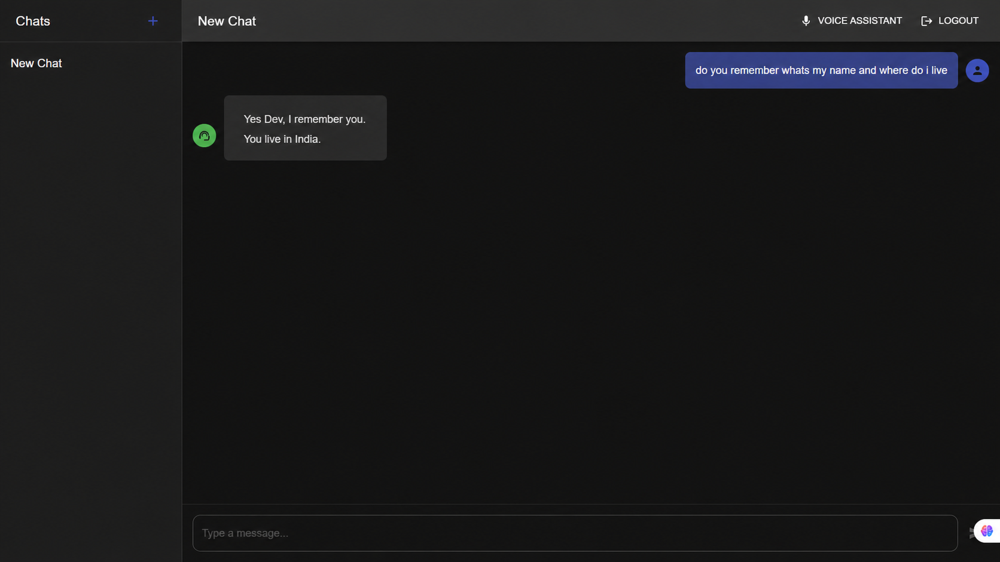

# NovaMind

[](https://opensource.org/licenses/Apache-2.0)
[](https://www.python.org/)
[](https://fastapi.tiangolo.com)
[](https://react.dev/)
[](https://github.com/langchain-ai/langgraph)
[](https://qdrant.tech/)
[](https://www.docker.com/)

NovaMind is a production-oriented AI assistant platform that combines a FastAPI backend, LangGraph-based agent orchestration, vector search, memory, and a modern React frontend. It supports secure authentication, multi-tenant data isolation, real-time chat streaming, and voice interaction through LiveKit.

## ✨ Features

- Secure authentication with JWT-based access control and user registration
- Multi-agent orchestration with LangGraph for complex reasoning workflows
- Semantic retrieval and conversation memory powered by Qdrant and Mem0
- MCP tool integrations for web search and scraping
- Voice-enabled assistance with LiveKit, speech-to-text, and text-to-speech
- A responsive React interface for chat, history, and user management

## 🛠️ Tech Stack

### Backend
- Python
- FastAPI
- LangChain and LangGraph
- Google Gemini models
- Qdrant vector database
- SQLAlchemy and Pydantic
- LiveKit agents and voice tooling

### Frontend
- React
- Material UI
- React Router
- Axios and React Markdown

## 🏗️ Architecture Overview

NovaMind follows a modular architecture:

1. The React frontend provides the user experience for chat, authentication, and voice mode.
2. The FastAPI backend exposes REST endpoints for authentication, chat, history, and LiveKit token generation.
3. LangGraph orchestrates agent workflows and delegates tasks to specialized components.
4. Qdrant and memory services support retrieval, persistence, and context-aware responses.
5. MCP servers extend the assistant with web search and scraping capabilities.

## 📁 Folder Structure

```text
app/
  agent/
  api/
    endpoints/
  core/
  db/
  mcp_client/
  mcp_server/
  models/
  schemas/
  services/
  utils/
frontend/
  public/
  src/
    components/
    contexts/
    pages/
    services/
```

## 📸 Application Preview



## ⚙️ Installation

### Prerequisites

- Python 3.10+ (3.13+ recommended)
- Node.js 18+
- npm 9+
- Docker (optional, useful for Qdrant)

### Backend Setup

1. Clone the repository

```bash
git clone <repository-url>
cd NovaMind
```

2. Create and activate a virtual environment

```bash
python -m venv venv
source venv/bin/activate
```

3. Install Python dependencies

```bash
pip install -r requirements.txt
```

4. Configure environment variables

Create a `.env` file in the project root:

```env
SECRET_KEY=your_secret_key_here
ACCESS_TOKEN_EXPIRE_MINUTES=30
SQLALCHEMY_DATABASE_URI=sqlite:///./app.db
GOOGLE_API_KEY=your_google_api_key_here
QDRANT_URL=https://<cluster>.cloud.qdrant.io
QDRANT_API_KEY=<api_key>
LIVEKIT_URL=your_livekit_url_here
LIVEKIT_API_KEY=your_livekit_api_key_here
LIVEKIT_API_SECRET=your_livekit_api_secret_here
LANGCHAIN_TRACING_V2=true
LANGSMITH_API_KEY=your_langsmith_api_key_here
LANGSMITH_PROJECT=your_project_name
```

### Frontend Setup

```bash
cd frontend
npm install
```

## ▶️ Running the Project

### Start the backend services

Run the MCP servers in separate terminals:

```bash
python -m app.mcp_server.search_server
python -m app.mcp_server.web_scrapping_server
```

Start the main FastAPI server:

```bash
python app.py
```

Start the LiveKit voice assistant:

```bash
python app/agent/livekit_agent.py dev
```

### Start the frontend

```bash
cd frontend
npm start
```

### Access the application

- API documentation: http://localhost:8000/docs
- Frontend UI: http://localhost:3000

If you do not already have an account, register first and then sign in to access the chat experience.

## 🔌 API Endpoints

The backend exposes the following primary endpoints:

- `POST /auth/register`
- `POST /auth/login`
- `GET /users/me`
- `PUT /users/me`
- `POST /chat/completions`
- `GET /history/chats`
- `GET /history/chats/{chat_id}`
- `POST /livekit/generate_token`

## 🚧 Future Improvements

- Add containerized deployment for production environments
- Expand automated test coverage and CI pipelines
- Improve observability with structured logging and tracing
- Add richer analytics and admin dashboards
- Support additional models and agent strategies

## 📄 License

This project is licensed under the Apache License 2.0.
